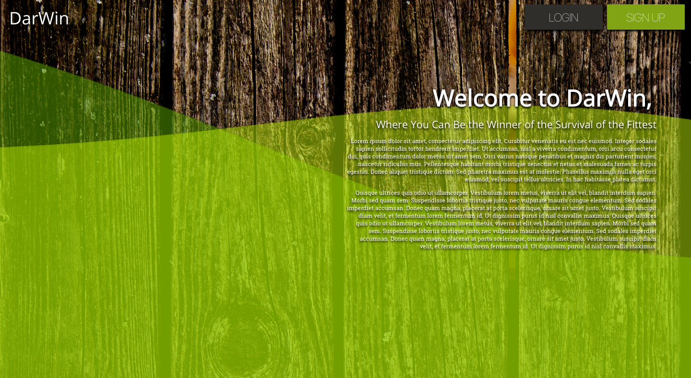
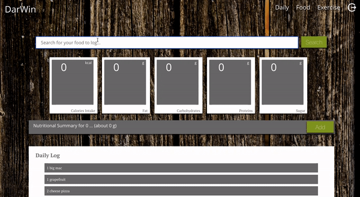
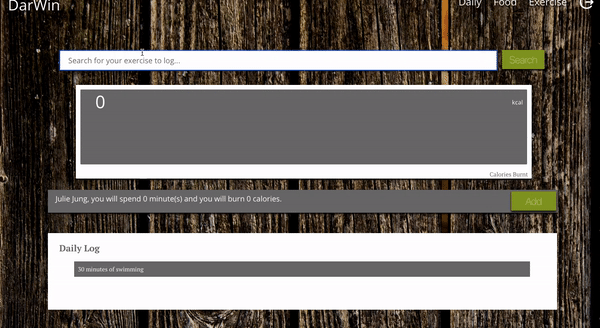

# DarWin

[DarWin](https://darwinfit.herokuapp.com/) is a web application, where users can keep track of their daily calorie intake and how much calories they have burnt. Users can search nutritional information of their food items as well as calories information of specific exercises with given amount of excercise time to record onto their log. The daily calories burnt also keeps track of the baseline calories burnt dependent on the users' weight, height, gender, and age.




## Table of Contents

1. [Getting Started](#getting-started)
   1. [Installing Dependencies](#installing-dependencies)
   1. [Development Environment](#development-environment)
1. [Authors](#authors)
1. [Built With](#built-with)
1. [Screenshots](#screenshots)
1. [Styling](#styling)
1. [Contributing](#contributing)

## Getting Started

### Installing Dependencies

From within the root directory:

```sh
sudo npm install -g bower
npm install
```

### Development Environment

To start up the server, from within the root directory:

```sh
npm run server-dev
```

To start up the front-end, from within the root directory:

```sh
npm run react-dev
```

## Authors

- **Product Owner**: Stas Savciuc
- **Scrum Master**: Julie Jung
- **Development Team Members**: Sarah Gujadhur, Arjun Logeswaran

## Built With

- [React](https://reactjs.org/)
- [React Router](https://www.npmjs.com/package/react-router)
- [MySQL](https://www.mysql.org/)
- [Node.JS](https://nodejs.org/en/)
- [Express](https://expressjs.com/)
- [Axios](https://github.com/axios/axios)
- [Firebase](https://firebase.google.com/)
- [react-chartjs-2](https://www.npmjs.com/package/react-chartjs-2)

## Screenshots


Once logged in, the user is led to the Daily page with the daily summary of calories intake and calories burnt.





User can search and input food items and exercises to keep track of their daily calorie log.

## Styling

DarWin uses the [Airbnb JavaScript Style Guide](https://github.com/airbnb/javascript/).

## Contributing

See [CONTRIBUTING.md](CONTRIBUTING.md) for contribution guidelines.
